# Analyzing and predicting 30-day readmission based on the 4D Data Science Framework

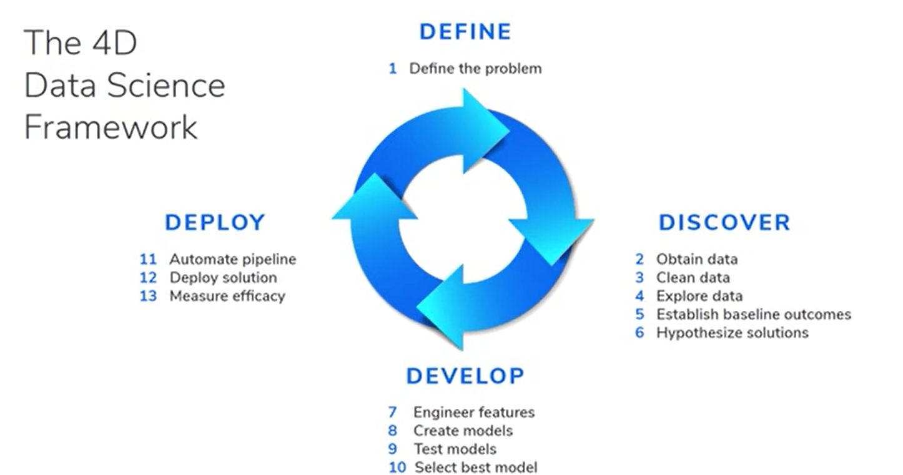

# Objectives

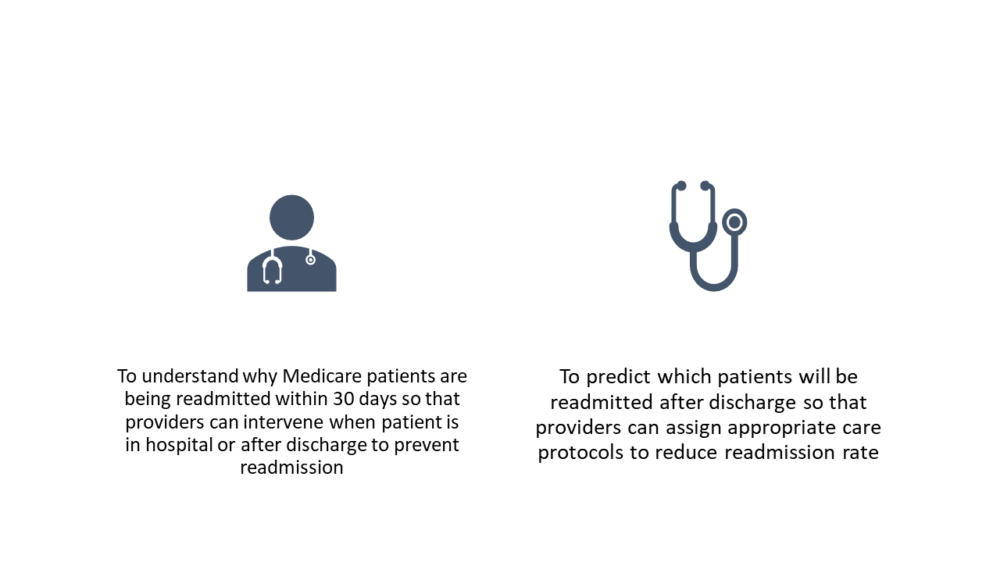

We will experiment with logistic regression and decision tree models as the results of these models are easy to interpret, especially the logistic regression model which shows us the effect of each variable. We will aim to minimize false negatives as we want to be conservative and take action on patients who will be readmitted, rather than missing them out as that will have negative impact on the patient's health and hospitals' financials. 

Statistical analysis (hypothesis testing) will be done to see if a variable significant leads to higher or lower readmission rate. 

# Defining the Problem

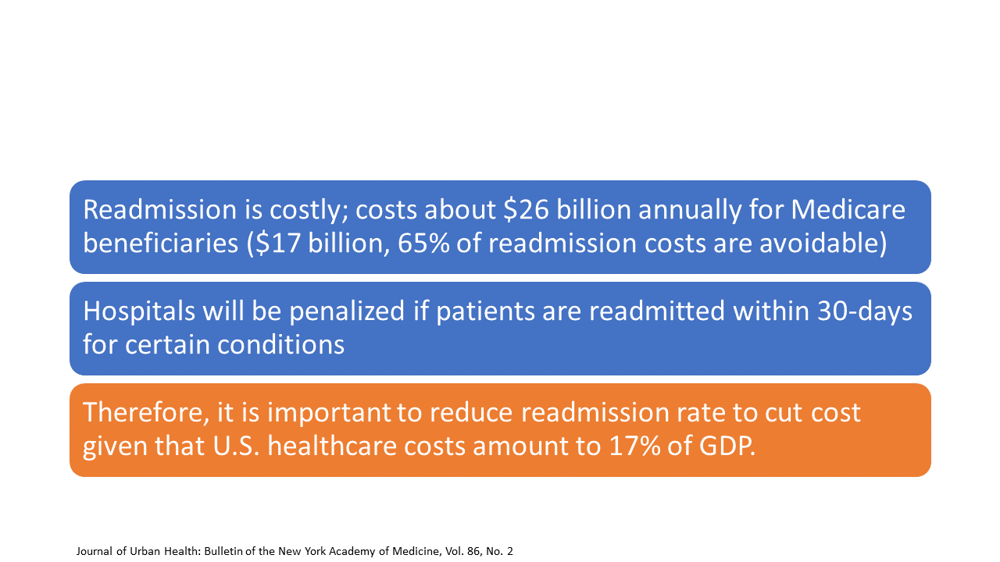

# Discovering the Data

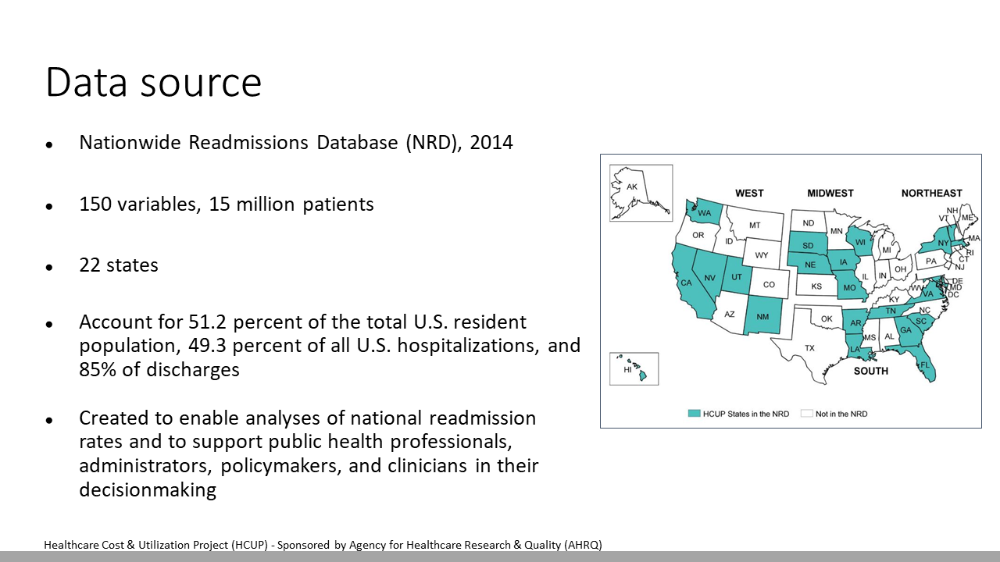

*Data source not uploaded in this repo for confidential reasons*

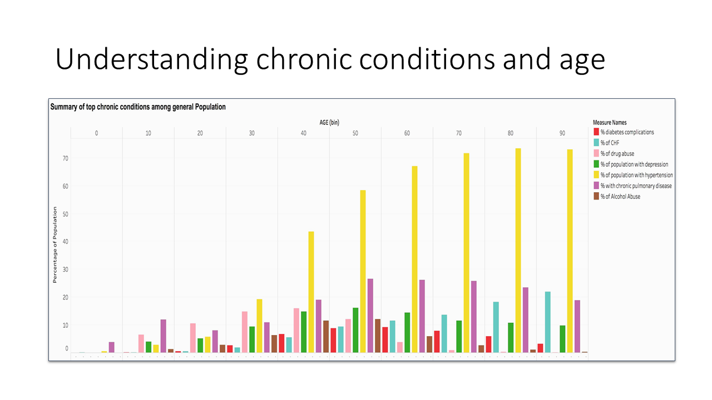

Hypertension is the most common chronic condition in the older population (>40 years old). For the adult population (20-40 years old), drug abuse is common, while COPD is common for the children and teenage population (10-20 years old).

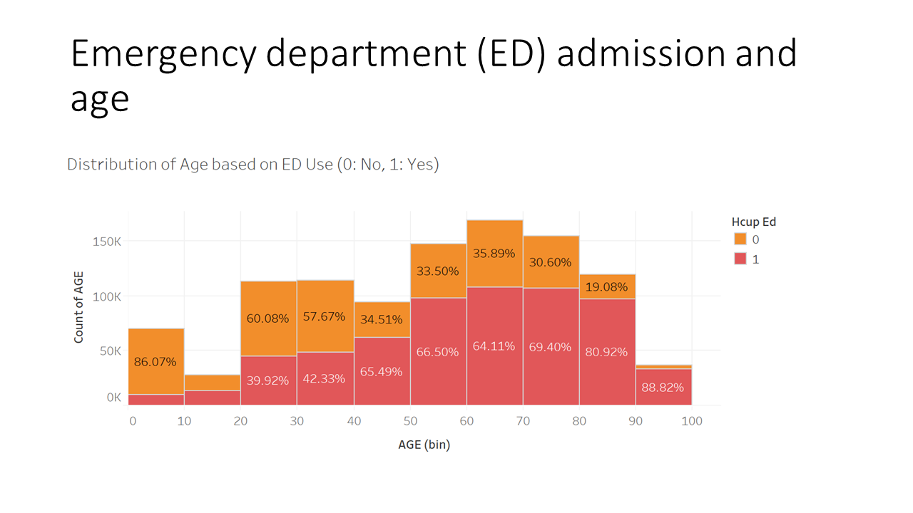

Age distribution is left skewed and most of the data is distributed across 50-80 years old. The population above 40 years old utilize ED more frequently, which is not surprising as people who are older tend to visit ED more often due to multiple chronic conditions.

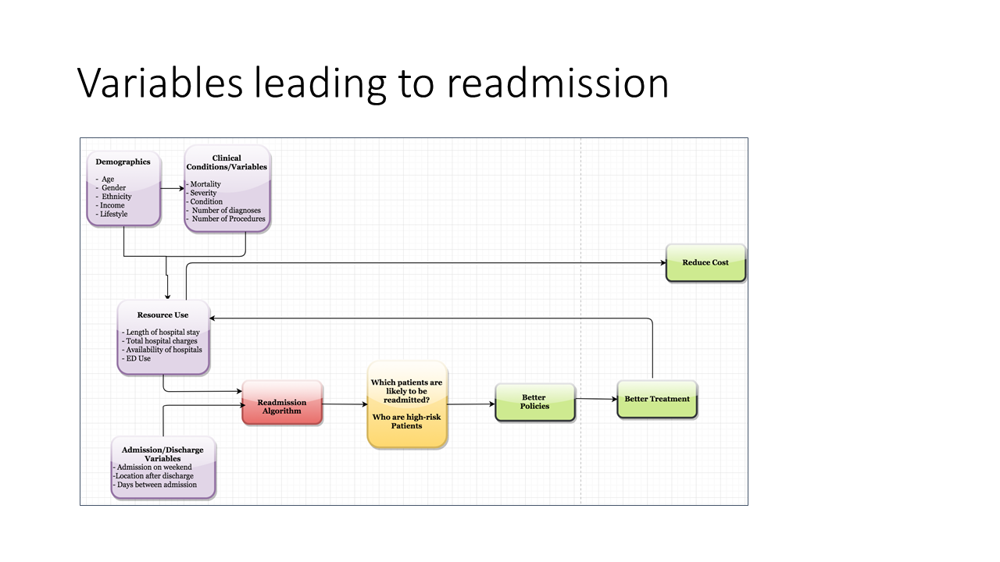

The figure above shows the variables leading to readmission, organized by type (demographics, clinical conditions, resource use, admission/discharge), and how the readmission algorithm can use these variables to predict which patients are likely to be readmitted in order to drive better treatment for patients to reduce readmission and cost.

## Reducing number of features

Since the plots above indicate that majority of the population is 50-80 years old, a subset of data is used to analyze and predict readmission due to limited computing resources in R.

150 variables in the original data set are reduced to 20 variables through a combination of literature review, domain knowledge, and feature engineering. Feature engineering technique used is Multi-Factor Analysis (MFA), which is a variant of PCA that works for categorical and numerical features. Based on MFA, demographic categorical variables such as income quartile, location, and gender are not important, hence these features are removed. 

A **logistic regression model with backward elimination** is then applied where all features are initially included in the model, and each feature that is not significant in the model is then removed until remaining features are significant, to determine variables that significantly predict readmission.

# Developing solution

Logistic regression model is used to analyze variables leading to readmission and predict patients will be readmitted within 30 days. This model is chosen because the results are easily interpretable. 

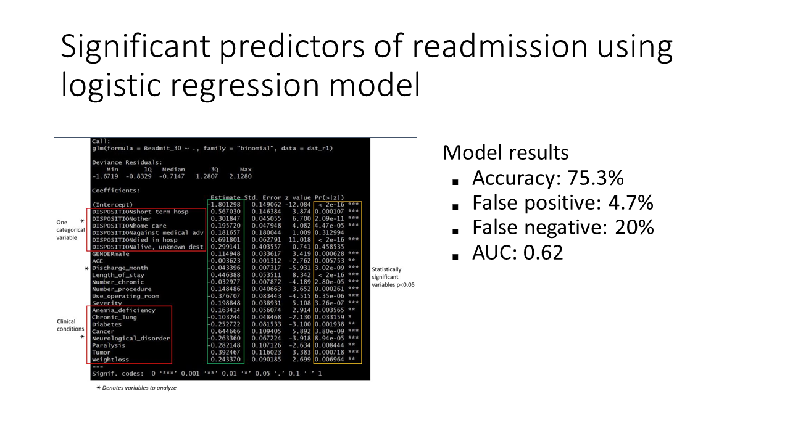

The variables shown above are significant predictors of readmission. We will examine how clinical conditions, disposition (type of care after discharge), and discharge month affect readmission.

## Understanding clinical conditions & readmission

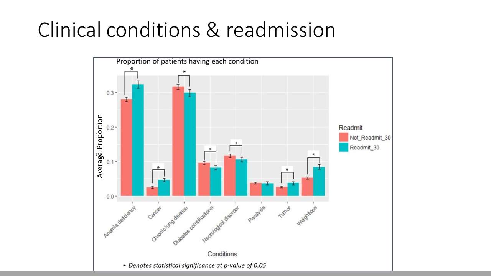

Patients with anemia deficiency, cancer, tumor, and weight loss are more likely to be readmitted while patients with chronic lung disease, diabetes, and neurological disorder are less likely to be readmitted. Providers could focus on patients with anemia deficiency, cancer, tumor, and weight loss to reduce readmission rate.

## Understanding disposition & readmission

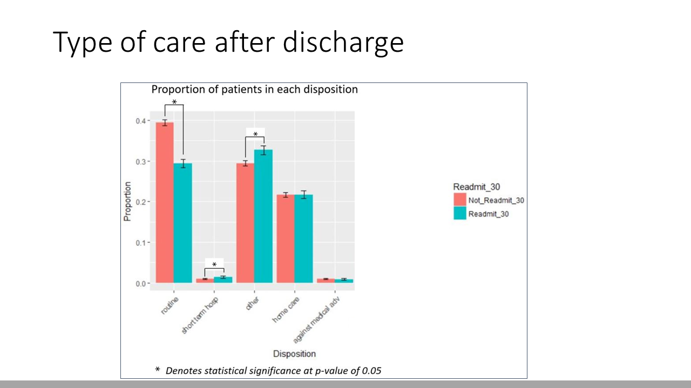

It is important to note that patients who receive routine care after discharge are significantly less likely readmitted. Combining with our previous finding, providers could focus on establishing routine care for patients with anemia deficiency, cancer, tumor, and weight loss to reduce readmission rate.

## Understanding season & readmission

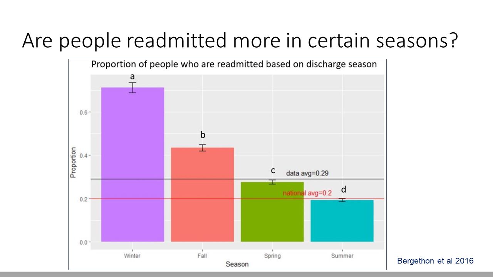

The porportion of people readmitted is significantly different in each season. It is not surprising that there are more readmission in the colder season and less so in the warmer season as flu season spread quickly in the winter compared to other months. The data has an average readmission rate of 29% compared to the national average of 20% because the data consists of older population between 50-80 years old, who are more sick and prone to readmission.

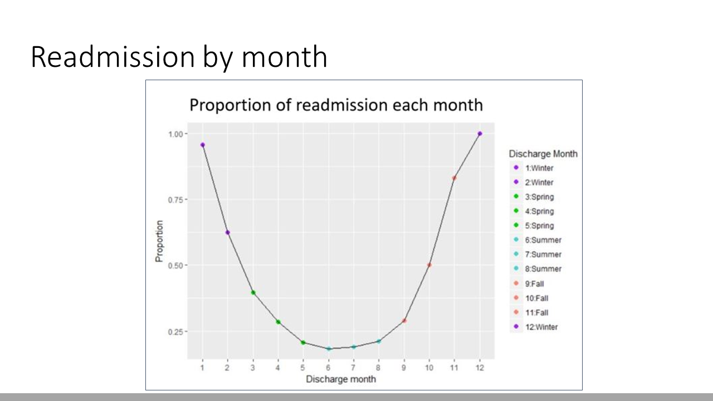

It is interesting to see a quadratic relationship between readmission and month as we see a peak of readmission in January steadily decreasing to a fall in June, and steadily increasing to a peak again in December.

## Comparing between logistic regression & decision tree model

Decision tree model is tuned by hand by removing features that are less important to the model and assigning more weight to false negative predictions so that the cutoff for a positive prediction is adjusted to minimize false negatives.

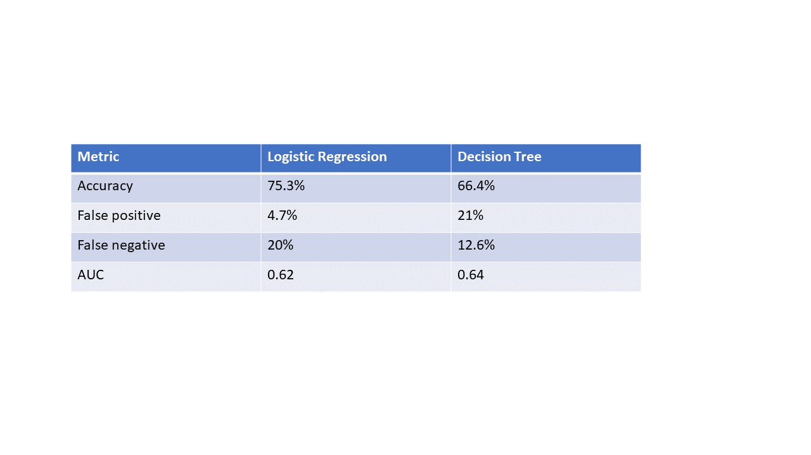

Although logistic regression model has a higher accuracy, it has a higher false negative rate and lower AUC than the decision tree model. The goal of predicting 30-day readmission is so that providers can take preventative measures to prevent patient readmission after discharge. False negatives should be minimized because we do not want to miss a patient who will be readmitted but the algorithm predict as not readmitted, which would negatively impact financial health of the hospital.

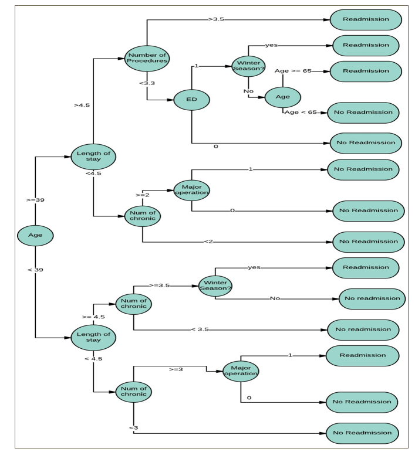

The above plot shows how the decision tree determines if a patient will be readmitted. We can consider the output of the decision tree to understand algorithm performance and build multiple trees using Random Forest or Gradient Boosting to get better results.

# Deploying model

Since out goal is to minimize false negaives, we will proceed with the decision tree model even though it has lower accuracy and higher false positives.

Although the model allows providers to intervene patients who are predicted to be readmitted, the model can be further improved via the following:

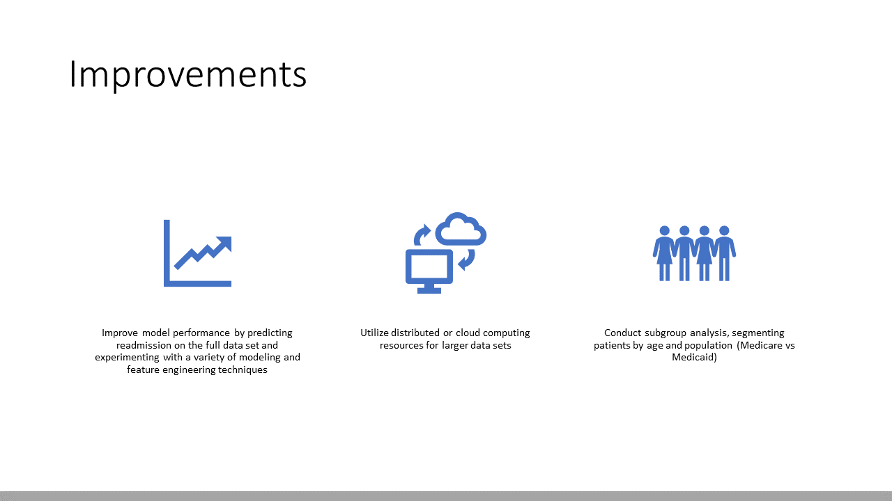

# Actionable recommendations

- Given the current model and analysis, providers could ensure that patients receive routine care after discharge to significantly reduce readmission rate, especially for older patients (50-80 years old) with anemia deficiency, cancer, tumor, and weight loss. 
- Since more patients are readmitted during the colder seasons, providers could take additional measures such as better patient education while they are in the hospital, and more routine follow up care after discharge through calls, text messages, regular appointments, and remote patient mointoring, to reduce readmission rate. 
